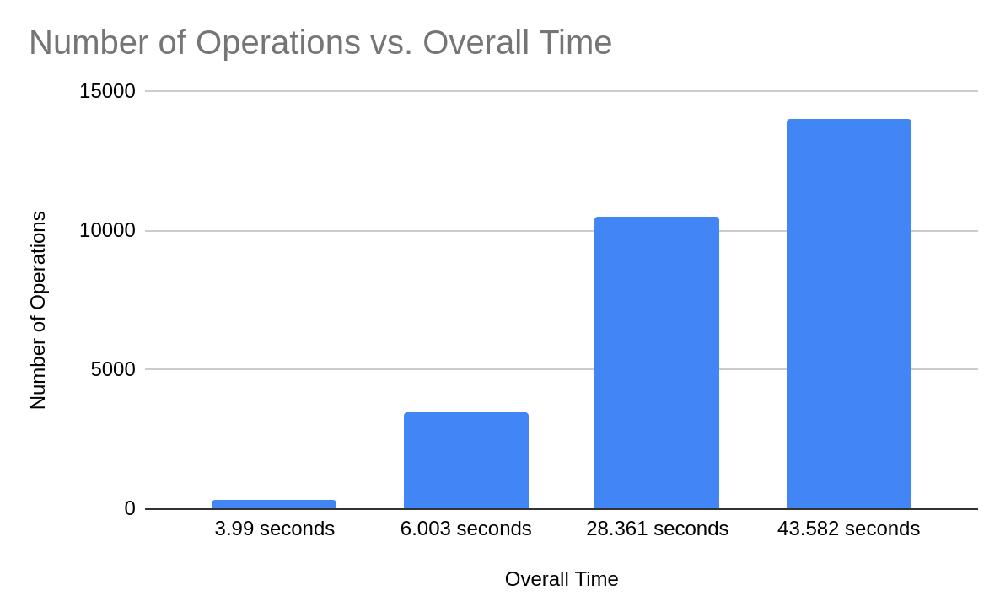
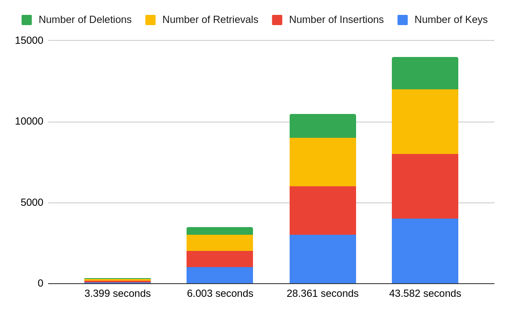

# LS3

LS3 is a local implementation of an block based storage API coined Local Simple Storage Solution

## Usage
LS3 offers a command line utility for inserting new key value pairs, retrieving them, and deleting them.
- put
	- `ls3 put` is a command that takes two arguments maximum: key [string], value [string]. this command puts the specified key value pair into storage. This command also has a `-f` flag that allow users to upload a file and its contents. In that case, the command only takes one argument. 
	- ex: `ls3 put 123 testing`
	- ex: `ls3 put -f testing.txt`
- get
	- `ls3 get` is a command that takes a single argument of the key [string] to be retrieved from storage. This command returns the data from the given key.
	- ex: `ls3 get 123`
- delete
	- `ls3 delete` is a command that takes one argument: key [string] and deletes that key from object storage if it exists.
	- ex: `ls3 delete 123`
## Performance AS OF 12/13/22

The below table represents some basi operations and their times as of December 2022.

|Number of Keys	|Number of Insertions	|Number of Retrievals	|Number of Deletions	|Number of Operations	|Overall Time 	|		
|---------------|-----------------------|-----------------------|-----------------------|-----------------------|---------------|
|	100			|		100				|		100				|		50				|			350			|	3.99 Sec	|
|	1000		|		1000			|		1000			|		500				|			3500		|	6.003 Sec	|
|	3000		|		3000			|		3000			|		1500			|			10500		|	28.361 Sec	|
|	4000		|		4000			|		4000			|		2000			|			14000		|	43.582 Sec	|

## Roadmap
 - implement `ls3 list`
 - define a FS type for mounting the datafile so it is registered with the Kernel.
 - Register a FS type for usage with an external drive
 - `ls3 format` command to make a file the proper type so the kernel recognizes it.
 - support for partial gets (only a certain amount of bytes)
 - support for concurrency
 - coalescing holes within storage and which holes to pick -- currently we pick the last hole
 - remove dependency on non file based arrays
 - make docs
 - performance statistics (table)
 - caching of data
 - disk layout / index management (table?)
 - add commands that can connect to remote object storage.
 - add memory awareness

### Related work
- http://www.eecs.harvard.edu/~michaelm/postscripts/im2005b.pdf
- https://dl.acm.org/doi/10.1145/356770.356776
- https://dl.acm.org/doi/abs/10.1145/146941.146943
- https://www.microsoft.com/en-us/research/wp-content/uploads/2007/04/TR-2005-176.pdf

